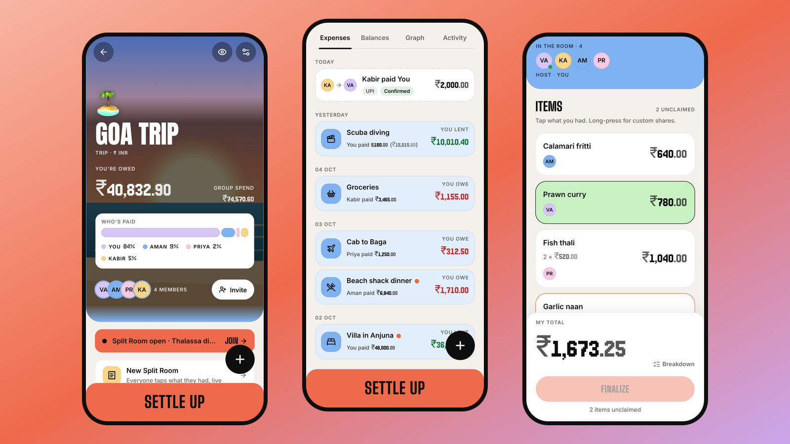
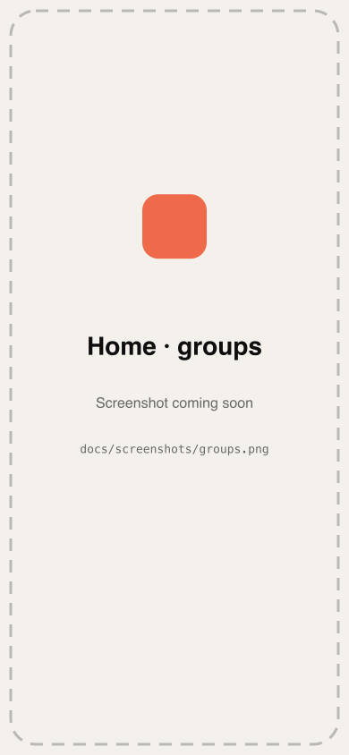
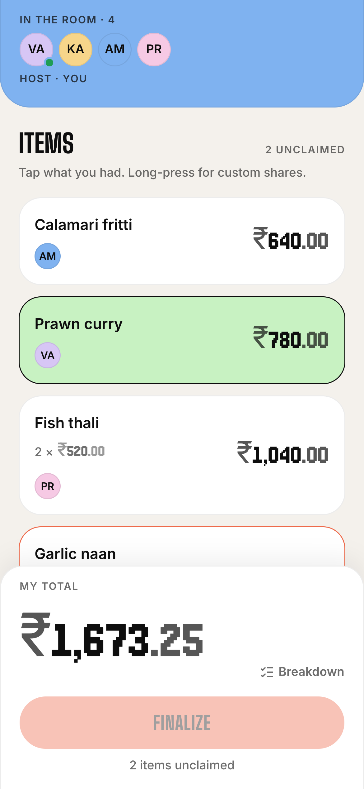
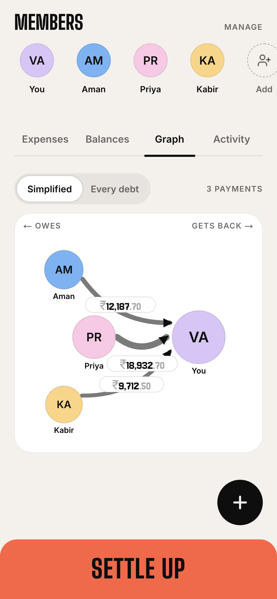
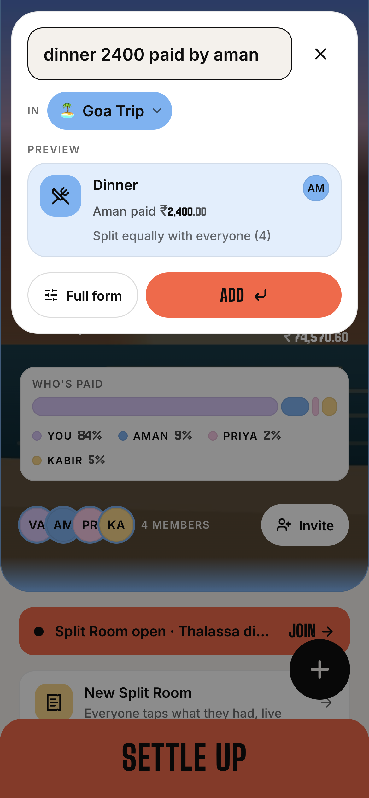
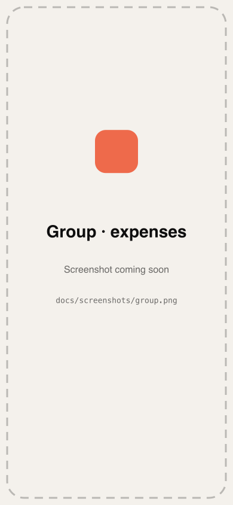
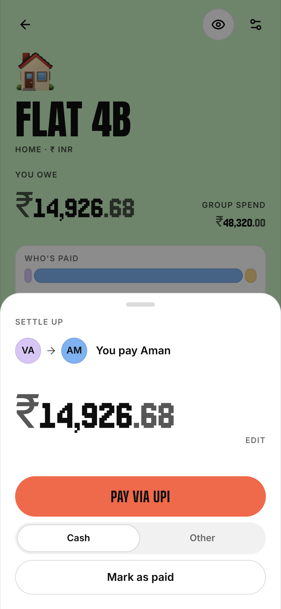
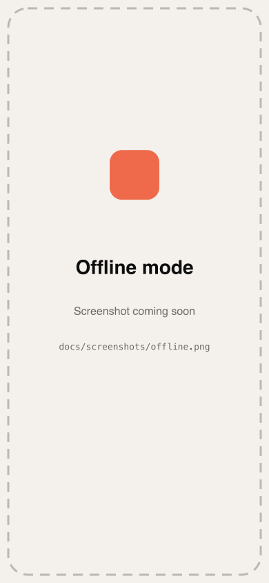
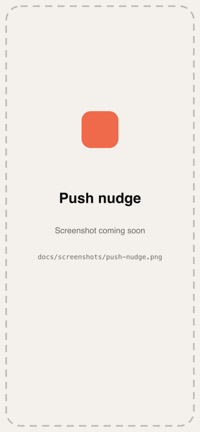
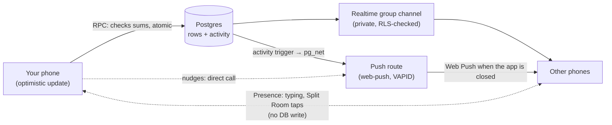

# Settld

**Split expenses with friends in real time, and settle up in one tap with UPI.**



**[Live demo → settld00.vercel.app](https://settld00.vercel.app)** · installable PWA (open it on your phone and Add to Home Screen)

Settld is a mobile-first shared-expense app for trips, flats and dinners. Every change shows up on everyone's phone within about a second. Debts are simplified to the fewest payments, and you settle with a UPI deep link that opens GPay or PhonePe with the amount filled in. It's built to feel like a native app: it works offline, sends push notifications, and has no passwords.

---

## Features

| | |
| --- | --- |
| **Split Room** | Everyone at the table opens the same bill by QR or a 6-character code and taps the items they had. Tax, service and tip are shared in proportion, totals update live on every phone, and the host finalizes it into one exact expense. |
| **Debt Graph** | A live, animated graph of who owes whom, switching between "every debt" and "simplified" views. Tap a person to settle up or nudge them. |
| **Command bar** | Type `dinner 2400 paid by aman split 4` or `cab $40 in goa` and press Enter. A parser handles amounts, currencies, people (fuzzy, by initials or nickname), groups and categories, and asks when something is ambiguous. |
| **Realtime sync** | Supabase Realtime on private per-group channels. Your own changes appear instantly (optimistic UI), and a presence pill shows "Aman is adding an expense…". |
| **UPI settle-up** | Opens your UPI app with `upi://pay?…`, then asks "Did it go through?" when you come back. The receiver confirms or disputes. A shareable receipt image is generated on the server. |
| **Multi-currency** | Expenses in any currency are converted at a locked exchange rate (Frankfurter, cached for 6 h), and balances are kept in the group's base currency. |
| **Push nudges** | Web Push with VAPID. Nudges get cheekier the more you send (polite → cheeky → dramatic), with a 1-hour cooldown and a daily cap enforced in the database. You also get notified about expenses that include you, payments, comments and confirmations. |
| **Offline mode** | A Serwist service worker caches the app shell and the groups you've viewed. Changes made offline are queued in IndexedDB, replayed in order on reconnect without duplicates, and anything the server rejects is kept with the reason, never dropped silently. |
| **Ghost members + phone invites** | Add friends who aren't on Settld yet by name (and an optional phone number), then send them a personal WhatsApp or SMS link. When they sign up through it, they take over that spot with all its history. |

<p>
  
  
  
  
</p>
<p>
  
  
  
  
</p>

---

## Tech stack

| Layer | Choice |
| --- | --- |
| Framework | Next.js 14 (App Router), TypeScript strict |
| UI | Tailwind CSS with CSS-variable design tokens (light/dark), Framer Motion (respects reduced motion) |
| Data | Supabase: Postgres, Row Level Security, Realtime, Storage, Auth (Google + email magic link/OTP) |
| Client state | TanStack Query v5 with optimistic updates |
| PWA | Serwist service worker, IndexedDB queue (idb-keyval), Web Push (`web-push`, VAPID), iOS splash screens |
| Images | `next/og` for invite posters and settlement receipts; `sharp` for icons |
| Tests | Vitest (unit and property tests), Playwright (end to end against a local Supabase), axe-core (WCAG AA) |
| Hosting | Vercel |

### Architecture

Every money write goes through one validated Postgres function (an RPC), so the server checks that every split adds up and saves it in one atomic transaction. Supabase Realtime then sends the result out to every member's phone.



- **Channels:** `group:<id>` (postgres_changes on expenses, settlements, members, activity, reactions, comments) and `room:<code>` for Split Room claims. Both are private, and joins are authorized by policies on `realtime.messages`.
- **Optimistic UI and deduplication:** each write carries a client-generated `client_id`, so retries are idempotent and a phone ignores the realtime echo of its own writes.
- **Balances:** a `group_balances` view (paid − owed ± settlements) is the single source of truth. After any change, clients re-read it rather than rebuilding it from events.
- **Offline:** queued writes replay in order with the same `client_id` once the app can reach the server again (checked with a real request, because `navigator.onLine` can be wrong).

---

## How the money math works

- **Integer minor units everywhere.** Amounts are stored and calculated in paise or cents as integers (`bigint` in Postgres, `BigInt` in TypeScript). There are no floats anywhere in the money path. Parsing (`toMinor`) rejects more than two decimals, and formatting is done from strings.
- **Exact rounding.** Equal, exact, percentage (basis points) and share splits are allocated with integer division. Leftover paise go to the first people in a stable order, so a split always adds up exactly to the total. ₹100 ÷ 3 = ₹33.34 + ₹33.33 + ₹33.33. Foreign-currency amounts are converted once with a locked rate (BigInt, rounded half up), and each line is allocated so the converted lines add up exactly to the converted total.
- **Debt simplification.** The app computes net balances, then repeatedly matches the person owed the most with the person who owes the most. That never needs more than n − 1 payments. The "every debt" view keeps the exact pairwise debts instead.
- **Property test.** A seeded generator creates 1,000+ random expenses (all four split types, one to three payers, 2–12 people, random currencies and rates, from ₹0.01 to ₹90bn, plus settlements, including disputed ones). The test asserts that every split sums to its total, every group's balances sum to zero, both payment plans settle everyone exactly, and simplification never uses more than n − 1 payments. Split Room maths has its own 2,000-room property test, and the server's Split Room maths is checked to match the client's exactly.

---

## Security

- **Row Level Security on every table.** Group data is readable only by current members (`is_member()`). There are no direct inserts, updates or deletes from clients: every write is a `security definer` function with `search_path = ''` that validates membership, roles and sums. Public execute is revoked; only the invite and room previews are callable by visitors who aren't signed in, and they return names and colors only.
- **Private phone numbers.** Numbers live outside `profiles`, in `user_phones` (readable by the owner only) and `ghost_phones` (readable by that group's admins only). They are never shown to other members. They aren't verified, so a number never grants access or claims anything.
- **Claim-link proof.** Taking over a ghost member's spot (with all its expenses and balance) requires that ghost's personal claim link, which is a random token. Having the same phone number or name isn't enough. Each link works once.
- **Realtime authorization.** Private channels check group membership through policies on `realtime.messages`, and every published table still has RLS.
- **Push webhook** calls are authenticated with a shared secret compared in constant time. Push subscriptions belong to the person who created them.
- **Checks:** `supabase/checks/advisors.sql` mirrors Supabase's security and performance advisors (RLS, function `search_path`, indexed foreign keys, `auth.uid()` init-plans and more).

---

## Local setup

**Requirements:** Node 20+, npm, and Docker (only for the local Supabase used by the end-to-end tests).

```bash
git clone https://github.com/6vansh9/SETTLD.git
cd SETTLD
npm install
cp .env.local.example .env.local   # then fill in the values (see below)
```

**Database (hosted Supabase project):** run the files in `supabase/migrations/` in order (`0001` → `0015`) in the SQL Editor. Each one is idempotent (`0013` is an intentional no-op). For push from the database, insert two rows into `private.app_settings`: `push_webhook_url` (`https://<your site>/api/push/webhook`) and `push_webhook_secret` (the same value as `PUSH_WEBHOOK_SECRET`). For email sign-in by code, add `{{ .Token }}` to the Magic Link and Confirm signup email templates.

```bash
npm run dev          # http://localhost:3000
npm test             # unit + property tests (Vitest)
npm run lint && npm run typecheck
```

**End-to-end tests** run against a local Supabase stack (`supabase/config.toml` uses ports 563xx; migrations are applied automatically):

```bash
npx supabase start
PW_CHROMIUM="/path/to/Chrome or Brave" npm run e2e
```

They cover:
- create group → invite → join → add expense → settle → confirm;
- offline queueing (3 offline expenses appear exactly once on the other device; a lost response doesn't create a duplicate);
- push delivery, decrypted at a local push service;
- the required profile fields;
- axe-core accessibility checks in light and dark mode with reduced motion.

### Environment variables

Names only. Never commit values; `.env.local` is git-ignored.

| Name | Where | What |
| --- | --- | --- |
| `NEXT_PUBLIC_SUPABASE_URL` | client + server | Supabase project URL |
| `NEXT_PUBLIC_SUPABASE_ANON_KEY` | client + server | Supabase anon (public) key |
| `SUPABASE_SERVICE_ROLE_KEY` | server only | Exchange-rate cache, push delivery |
| `NEXT_PUBLIC_VAPID_PUBLIC_KEY` | client + server | Web Push public key (`npx web-push generate-vapid-keys`) |
| `VAPID_PRIVATE_KEY` | server only | Web Push private key |
| `VAPID_SUBJECT` | server only | Your site URL (or a `mailto:`) |
| `PUSH_WEBHOOK_SECRET` | server only | Shared secret for the database → push webhook |
| `NEXT_PUBLIC_SITE_URL` | optional | Public address used in links, share text and Open Graph (defaults to `https://settld00.vercel.app`; sign-in redirects always use the current address) |

---

## Project layout

```
app/                    routes (App Router), API routes (push, fx, og images), service worker (sw.ts)
components/ui/          design-system kit: Amount, Card, Sheet, Numpad, SplitBar, Avatar…
components/features/    expense, settle, split-room, debt-graph, command-bar, offline, push…
lib/                    money.ts, simplify.ts, parser.ts, splitRoom.ts, offline/, realtime/, queries/
supabase/migrations/    schema, RLS and RPCs, numbered and idempotent
supabase/checks/        SQL checks (advisors, migration checks)
e2e/                    Playwright specs
docs/screenshots/       README images
```

Product spec and design system: [`PRD.md`](PRD.md).
